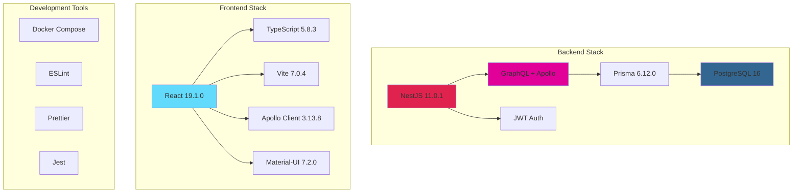
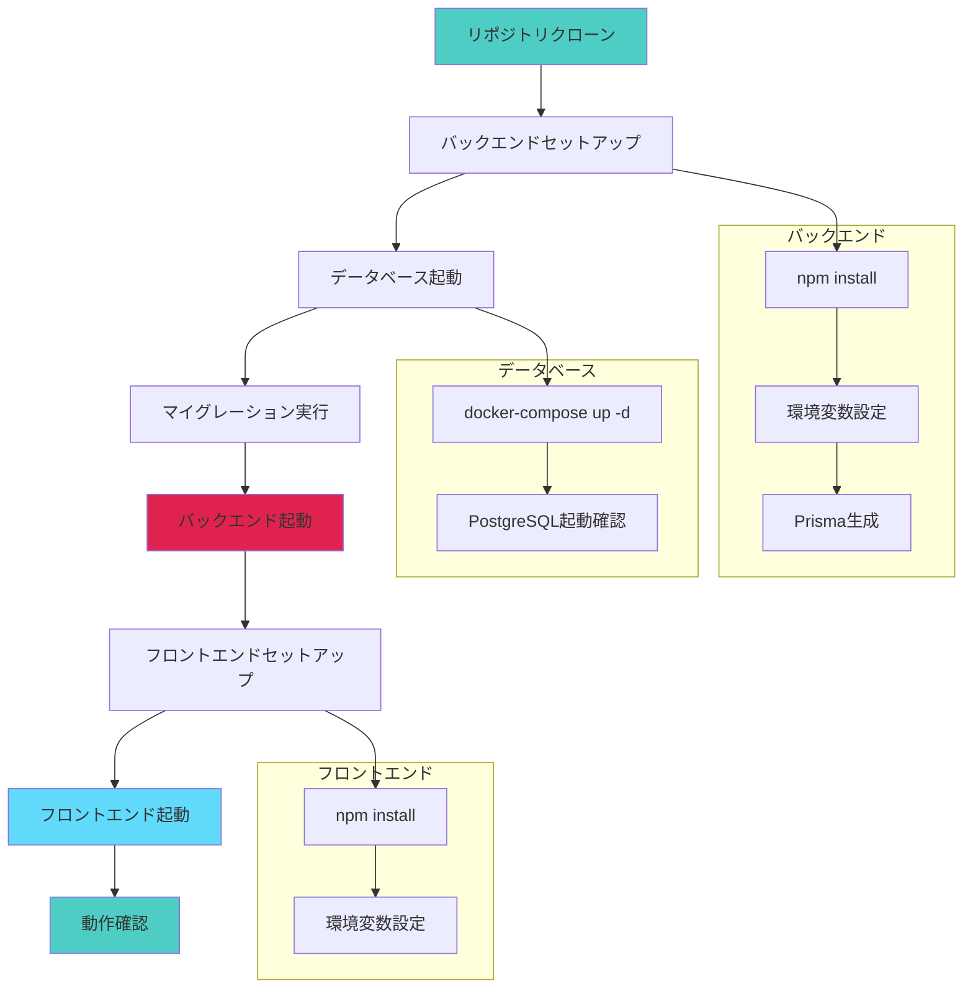
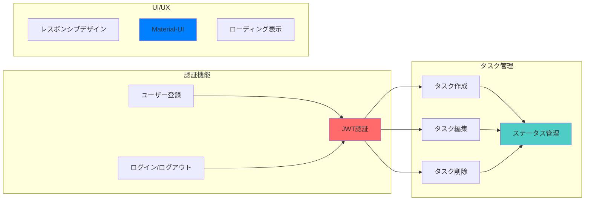

# GraphQL + NestJS タスク管理アプリケーション

## 📋 プロジェクト概要

このプロジェクトは、GraphQL を使用したモダンなタスク管理アプリケーションです。  
NestJS をバックエンド API として、React + TypeScript をフロントエンドとして構築されています。

※本アプリは Udemy の講座をベースにリファクタリングを加えた状態となっております。

## 🏗️ アーキテクチャ

### 全体システム構成


### プロジェクト構造


### データフロー


### 技術スタック比較



### バックエンド

- **NestJS** - Node.js フレームワーク
- **GraphQL** - API クエリ言語
- **Prisma** - データベース ORM
- **JWT** - 認証システム

### フロントエンド

- **React** - UI ライブラリ
- **TypeScript** - 型安全な開発
- **Vite** - 高速ビルドツール
- **Apollo Client** - GraphQL クライアント
- **Material-UI** - UI コンポーネント

## 🚀 クイックスタート

### 前提条件

- Node.js (v18 以上)
- Docker & Docker Compose
- PostgreSQL

### セットアップフロー



### 詳細セットアップ手順

1. **リポジトリクローン**

   ```bash
   git clone <repository-url>
   cd GraphQL_NestJS
   ```

2. **バックエンド起動**

   ```bash
   cd backend
   npm install
   cp env.example .env  # 環境変数設定
   docker-compose up -d  # PostgreSQL起動
   npx prisma migrate deploy
   npm run start:dev
   ```

3. **フロントエンド起動**
   ```bash
   cd frontend
   npm install
   cp env.example .env  # 環境変数設定
   npm run dev
   ```

### 動作確認

| サービス           | URL                           | 説明                   |
| ------------------ | ----------------------------- | ---------------------- |
| フロントエンド     | http://localhost:5173         | React アプリケーション |
| バックエンド       | http://localhost:3000         | NestJS API サーバー    |
| GraphQL Playground | http://localhost:3000/graphql | GraphQL API テスト     |

## 📁 プロジェクト詳細

各ディレクトリの詳細な情報については、以下の README を参照してください：

- [バックエンド詳細](./backend/README.md)
- [フロントエンド詳細](./frontend/README.md)

## 🔧 主な機能

### 機能概要



### 機能詳細

| 機能カテゴリ   | 機能名               | 説明                         |
| -------------- | -------------------- | ---------------------------- |
| **認証**       | ユーザー登録         | 新規アカウント作成           |
| **認証**       | ログイン/ログアウト  | JWT 認証によるセキュアな認証 |
| **タスク管理** | タスク作成           | 新しいタスクの追加           |
| **タスク管理** | タスク編集           | 既存タスクの内容修正         |
| **タスク管理** | タスク削除           | 不要なタスクの削除           |
| **タスク管理** | ステータス管理       | 3 段階のタスクステータス管理 |
| **UI/UX**      | レスポンシブデザイン | デスクトップ・モバイル対応   |
| **UI/UX**      | Material-UI          | モダンなマテリアルデザイン   |

## 📝 ライセンス

This project is for educational purposes.
