# GraphQL + NestJS タスク管理アプリケーション

## 📋 プロジェクト概要

このプロジェクトは、GraphQL を使用したモダンなタスク管理アプリケーションです。  
NestJS をバックエンド API として、React + TypeScript をフロントエンドとして構築されています。

※本アプリは Udemy の講座をベースにリファクタリングを加えた状態となっております。

## 🏗️ アーキテクチャ

### 全体システム構成


### プロジェクト構造


### データフロー

```mermaid
sequenceDiagram
    participant User as ユーザー
    participant Frontend as React Frontend
    participant Apollo as Apollo Client
    participant Backend as NestJS Backend
    participant DB as PostgreSQL

    User->>Frontend: タスク操作
    Frontend->>Apollo: GraphQL Query/Mutation
    Apollo->>Backend: HTTP Request with JWT
    Backend->>Backend: JWT認証
    Backend->>DB: Database Query
    DB-->>Backend: Query Result
    Backend-->>Apollo: GraphQL Response
    Apollo-->>Frontend: Data Update
    Frontend-->>User: UI Update
```



### 技術スタック比較


### バックエンド

- **NestJS** - Node.js フレームワーク
- **GraphQL** - API クエリ言語
- **Prisma** - データベース ORM
- **JWT** - 認証システム

### フロントエンド

- **React** - UI ライブラリ
- **TypeScript** - 型安全な開発
- **Vite** - 高速ビルドツール
- **Apollo Client** - GraphQL クライアント
- **Material-UI** - UI コンポーネント

## 🚀 クイックスタート

### 前提条件

- Node.js (v18 以上)
- Docker & Docker Compose
- PostgreSQL

### セットアップフロー

```mermaid
graph TD
    A[リポジトリクローン] --> B[バックエンドセットアップ]
    B --> C[データベース起動]
    C --> D[マイグレーション実行]
    D --> E[バックエンド起動]
    E --> F[フロントエンドセットアップ]
    F --> G[フロントエンド起動]
    G --> H[動作確認]

    subgraph "バックエンド"
        B1[npm install]
        B2[環境変数設定]
        B3[Prisma生成]
    end

    subgraph "データベース"
        C1[docker-compose up -d]
        C2[PostgreSQL起動確認]
    end

    subgraph "フロントエンド"
        F1[npm install]
        F2[環境変数設定]
    end

    B --> B1
    B1 --> B2
    B2 --> B3
    C --> C1
    C1 --> C2
    F --> F1
    F1 --> F2

    classDef startEndStyle fill:#4ecdc4,stroke:#000,color:#000
    classDef backendStyle fill:#e0234e
    classDef frontendStyle fill:#61dafb,stroke:#000,color:#000

    class A startEndStyle
    class H startEndStyle
    class E backendStyle
    class G frontendStyle
```



### 詳細セットアップ手順

1. **リポジトリクローン**

   ```bash
   git clone <repository-url>
   cd GraphQL_NestJS
   ```

2. **バックエンド起動**

   ```bash
   cd backend
   npm install
   cp .env.example .env  # 環境変数設定
   docker-compose up -d  # PostgreSQL起動
   npx prisma migrate deploy
   npm run start:dev
   ```

3. **フロントエンド起動**
   ```bash
   cd frontend
   npm install
   cp env.example .env  # 環境変数設定
   npm run dev
   ```

### 動作確認

| サービス           | URL                           | 説明                   |
| ------------------ | ----------------------------- | ---------------------- |
| フロントエンド     | http://localhost:5173         | React アプリケーション |
| バックエンド       | http://localhost:3000         | NestJS API サーバー    |
| GraphQL Playground | http://localhost:3000/graphql | GraphQL API テスト     |

## 📁 プロジェクト詳細

各ディレクトリの詳細な情報については、以下の README を参照してください：

- [バックエンド詳細](./backend/README.md)
- [フロントエンド詳細](./frontend/README.md)

## 🔧 主な機能

### 機能概要

```mermaid
graph LR
    subgraph "認証機能"
        SignUp[ユーザー登録]
        SignIn[ログイン/ログアウト]
        JWT[JWT認証]
    end

    subgraph "タスク管理"
        Create[タスク作成]
        Edit[タスク編集]
        Delete[タスク削除]
        Status[ステータス管理]
    end

    subgraph "UI/UX"
        Responsive[レスポンシブデザイン]
        MaterialUI[Material-UI]
        Loading[ローディング表示]
    end

    SignUp --> JWT
    SignIn --> JWT
    JWT --> Create
    JWT --> Edit
    JWT --> Delete
    Create --> Status
    Edit --> Status
    Delete --> Status

    classDef jwtStyle fill:#ff6b6b
    classDef statusStyle fill:#4ecdc4,stroke:#000,color:#000
    classDef materialStyle fill:#007fff

    class JWT jwtStyle
    class Status statusStyle
    class MaterialUI materialStyle
```



### 機能詳細

| 機能カテゴリ   | 機能名               | 説明                         |
| -------------- | -------------------- | ---------------------------- |
| **認証**       | ユーザー登録         | 新規アカウント作成           |
| **認証**       | ログイン/ログアウト  | JWT 認証によるセキュアな認証 |
| **タスク管理** | タスク作成           | 新しいタスクの追加           |
| **タスク管理** | タスク編集           | 既存タスクの内容修正         |
| **タスク管理** | タスク削除           | 不要なタスクの削除           |
| **タスク管理** | ステータス管理       | 3 段階のタスクステータス管理 |
| **UI/UX**      | レスポンシブデザイン | デスクトップ・モバイル対応   |
| **UI/UX**      | Material-UI          | モダンなマテリアルデザイン   |

## 📝 ライセンス

This project is for educational purposes.
