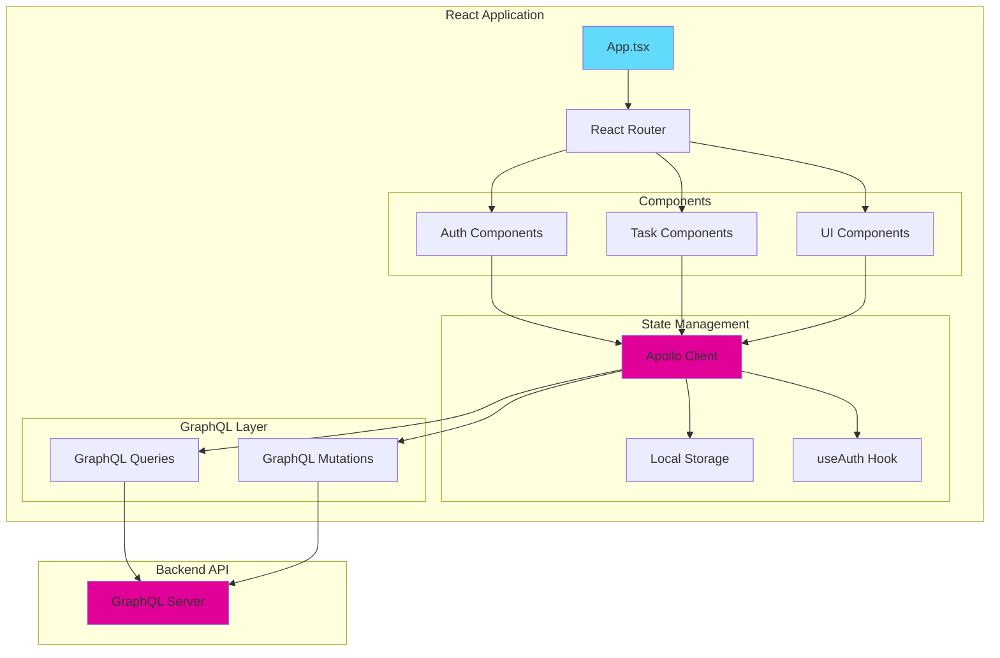
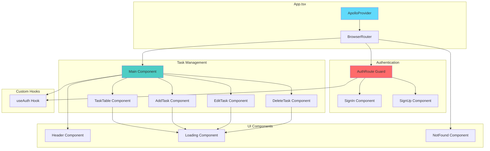
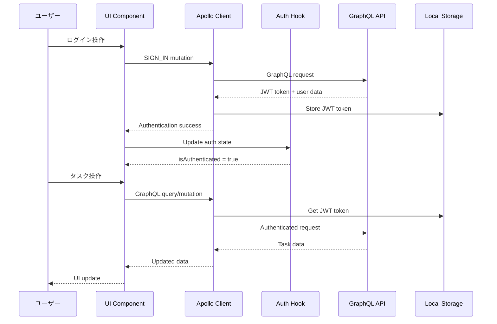

# TaskFlow Frontend

## 📱 アプリ名

**TaskFlow** - GraphQL タスク管理アプリケーション

## 📋 概要

TaskFlow は、モダンな React + TypeScript + GraphQL で構築されたタスク管理アプリケーションのフロントエンドです。
直感的なユーザーインターフェースで、効率的なタスク管理を実現します。

## 🏗️ システム構成図

### フロントエンドアーキテクチャ



### コンポーネント構成図



### データフロー図



### ルーティング構成図

```mermaid
graph LR
    subgraph "Public Routes"
        SignIn[/signin]
        SignUp[/signup]
    end

    subgraph "Protected Routes"
        Main[/]
    end

    subgraph "Fallback"
        NotFound[/*]
    end

    SignIn --> AuthRoute
    SignUp --> AuthRoute
    Main --> PrivateRoute
    NotFound --> NotFoundComponent

    AuthRoute --> GuestRoute
    PrivateRoute --> useAuth

    style SignIn fill:#ff6b6b
    style Main fill:#4ecdc4
    style NotFound fill:#95a5a6
```

## ✨ 機能・機能の説明

### 🔐 認証機能

- **ユーザー登録**: 新規アカウント作成
- **ログイン/ログアウト**: JWT 認証によるセキュアな認証
- **認証状態管理**: ルートガードによる自動リダイレクト

### 📝 タスク管理機能

- **タスク一覧表示**: 登録済みタスクの表形式での表示
- **タスク作成**: 新しいタスクの追加（タスク名、期日、ステータス設定）
- **タスク編集**: 既存タスクの内容修正
- **タスク削除**: 不要なタスクの削除
- **ステータス管理**: 3 段階のタスクステータス
  - `NOT_STARTED` (未着手)
  - `IN_PROGRESS` (進行中)
  - `COMPLETED` (完了)

### 🎨 ユーザーインターフェース

- **レスポンシブデザイン**: デスクトップ・モバイル対応
- **Material-UI**: モダンなマテリアルデザイン
- **ローディング表示**: データ取得中の視覚的フィードバック
- **エラーハンドリング**: 分かりやすいエラー表示

## 🛠️ 技術スタック

### 言語・フレームワーク

-  **React** `19.1.0` - UI ライブラリ
-  **TypeScript** `5.8.3` - 型安全な開発
-  **Vite** `7.0.4` - 高速ビルドツール

### 主要ライブラリ

-  **Apollo Client** `3.13.8` - GraphQL クライアント
-  **Material-UI** `7.2.0` - UI コンポーネントライブラリ
-  **React Router DOM** `7.7.1` - ルーティング管理
-  **JWT Decode** `4.0.0` - JWT トークン デコード
-  **Modern CSS Reset** `1.4.0` - CSS リセット

### 開発ツール

-  **ESLint** - コード品質管理
-  **TypeScript ESLint** - TypeScript 用リンター

## 🚀 環境構築手順

### 前提条件

- Node.js (v18 以上推奨)
- npm または yarn

### 1. 依存関係のインストール

```bash
npm install
```

### 2. 環境変数設定

#### 方法 1: テンプレートファイルを使用

```bash
# テンプレートファイルをコピー
cp env.example .env

# .envファイルを編集して実際の値に置き換え
nano .env
```

#### 方法 2: 手動で.env ファイルを作成

`.env`ファイルを作成し、以下の環境変数を設定：

```bash
# ========================================
# GraphQL API設定
# ========================================

# GraphQL APIエンドポイント
# バックエンドAPIのGraphQLエンドポイントURL
VITE_GRAPHQL_API_URL="http://localhost:3000/graphql"

# ========================================
# アプリケーション設定
# ========================================

# アプリケーション環境
VITE_NODE_ENV=development

# アプリケーションタイトル
VITE_APP_TITLE="TaskFlow"

# デバッグモード有効化
VITE_DEBUG_MODE=true
```

#### 環境変数の説明

| 変数名                 | 必須 | 説明                           | デフォルト値                    |
| ---------------------- | ---- | ------------------------------ | ------------------------------- |
| `VITE_GRAPHQL_API_URL` | ✅   | GraphQL API エンドポイント URL | `http://localhost:3100/graphql` |
| `VITE_NODE_ENV`        | ❌   | アプリケーション環境           | `development`                   |
| `VITE_APP_TITLE`       | ❌   | アプリケーションタイトル       | `TaskFlow`                      |
| `VITE_DEBUG_MODE`      | ❌   | デバッグモード有効化           | `true`                          |

**注意**: Vite では、環境変数は`VITE_`プレフィックスが必要です。

### 3. 開発サーバー起動

```bash
# 開発モード（ホットリロード有効）
npm run dev
```

アプリケーションは `http://localhost:5173` で起動します。

### 4. ビルド（本番用）

```bash
# TypeScriptコンパイル + Viteビルド
npm run build

# ビルド結果のプレビュー
npm run preview
```

### 5. コード品質チェック

```bash
# ESLintによるコード検査
npm run lint
```

## 📂 プロジェクト構造

```
src/
├── components/              # Reactコンポーネント
│   ├── AddTask.tsx         # タスク追加フォーム
│   ├── EditTask.tsx        # タスク編集フォーム
│   ├── DeleteTask.tsx      # タスク削除確認
│   ├── TaskTable.tsx       # タスク一覧表示テーブル
│   ├── SignIn.tsx          # ログインフォーム
│   ├── SignUp.tsx          # ユーザー登録フォーム
│   ├── Header.tsx          # ヘッダーナビゲーション
│   ├── Main.tsx            # メインページ（タスク管理）
│   ├── Loading.tsx         # ローディングコンポーネント
│   └── NotFound.tsx        # 404ページ
├── hooks/                  # カスタムフック
│   └── useAuth.ts          # 認証状態管理フック
├── mutations/              # GraphQL mutations
│   ├── authMutations.ts    # 認証関連mutation
│   └── taskMutations.ts    # タスク関連mutation
├── queries/                # GraphQL queries
│   └── taskQueries.ts      # タスク関連query
├── types/                  # TypeScript型定義
│   ├── payload.ts          # JWTペイロード型
│   ├── signinResponse.ts   # ログイン応答型
│   ├── task.ts             # タスク型
│   ├── taskStatus.ts       # タスクステータス型
│   ├── user.ts             # ユーザー型
│   └── modern-css-reset.d.ts # CSS型定義
├── utils/                  # ユーティリティ関数
│   └── dateUtils.ts        # 日付処理ユーティリティ
├── apolloClient.ts         # Apollo Client設定
├── AuthRoute.tsx           # 認証ルートガード
├── App.tsx                 # アプリケーションルート
├── App.css                 # アプリケーションスタイル
├── index.css               # グローバルスタイル
└── main.tsx               # アプリケーションエントリーポイント
```

### ファイル説明

#### コンポーネント

- **認証系**: `SignIn.tsx`, `SignUp.tsx` - ユーザー認証
- **タスク管理系**: `AddTask.tsx`, `EditTask.tsx`, `DeleteTask.tsx`, `TaskTable.tsx` - タスク CRUD 操作
- **UI 系**: `Header.tsx`, `Loading.tsx`, `NotFound.tsx` - 共通 UI コンポーネント
- **ページ系**: `Main.tsx` - メインアプリケーションページ

#### GraphQL 層

- **Queries**: データ取得用 GraphQL クエリ
- **Mutations**: データ変更用 GraphQL ミューテーション
- **Apollo Client**: GraphQL クライアント設定と認証連携

#### 型定義

- **認証系**: JWT ペイロード、ログイン応答型
- **データ系**: タスク、ユーザー、ステータス型
- **UI 系**: CSS 型定義

## 🔗 関連リンク

- [バックエンド API](../backend/README.md)
- [プロジェクト概要](../README.md)
- [GraphQL Playground](http://localhost:3000/graphql) (開発環境)

## 🚀 開発ガイド

### 開発環境のセットアップ

1. **バックエンドの起動確認**

   ```bash
   # バックエンドディレクトリで
   cd ../backend
   npm run start:dev
   ```

2. **フロントエンドの起動**

   ```bash
   # フロントエンドディレクトリで
   cd frontend
   npm run dev
   ```

3. **動作確認**
   - フロントエンド: http://localhost:5173
   - バックエンド: http://localhost:3000
   - GraphQL Playground: http://localhost:3000/graphql

### デバッグ方法

- **ブラウザ開発者ツール**: ネットワークタブで GraphQL リクエストを確認
- **Apollo Client DevTools**: ブラウザ拡張機能で GraphQL キャッシュを確認
- **環境変数確認**: `console.log(import.meta.env)` で環境変数を確認

### トラブルシューティング

| 問題               | 解決方法                         |
| ------------------ | -------------------------------- |
| GraphQL 接続エラー | バックエンドが起動しているか確認 |
| 認証エラー         | JWT トークンの有効期限を確認     |
| ビルドエラー       | TypeScript の型定義を確認        |

## 📝 ライセンス

This project is for educational purposes.
